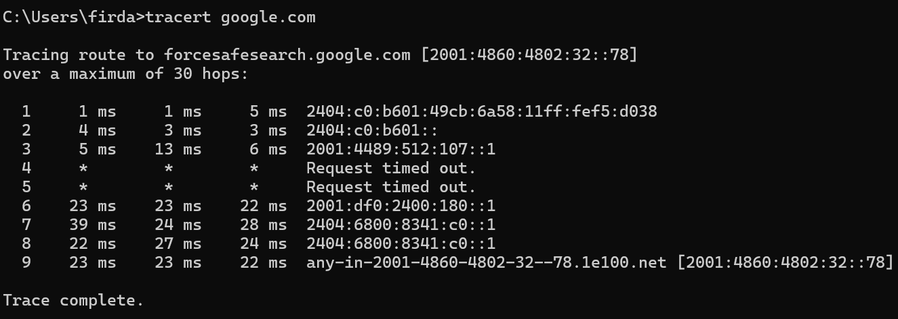

# Modul 10 - IP
#### Firda Utami Sukman - 103072400147 - IF-04-05

## 1. Apa itu IP Address?

IP Address (Internet Protocol Address) adalah alamat unik yang digunakan untuk mengidentifikasi perangkat pada jaringan komputer atau internet.

Contohnya:
- IPv4 : 192.168.1.1
- IPv6 : 2001:db8::1

IP Address berfungsi sebagai identitas perangkat di jaringan, menentukan alamat tujuan pengiriman data, dan mempermudah komunikasi antar perangkat dalam jaringan.

## 2. Traceroute dari suatu Website

Langkah - langkah melakukan traceroute:
- Buka Command Prompt
- Ketik website yang ingin dicek contoh tracert google.com
- Tekan enter
- Akan muncul daftar router/hop yang dilewati paket menuju website tujuan.

    

    Hasil traceroute menunjukkan bahwa paket data melewati beberapa router sebelum mencapai server tujuan Google dengan alamat IPv6: *2001:4860:4802:32::78*. Terdapat total sekitar 9 hop sebelum mencapai tujuan akhir. Dan pada hop ke-4 dan k-5 muncul pesan: *Request timed out*, Ini terjadi karena router pada hop tersebut tidak memberikan respon ICMP, namun paket tetap dapat melanjutkan perjalanan ke tujuan akhir.

## 3. Apa itu ICMP, MTU, dan TTL?

 - **ICMP (Internet Control Message Protocol)**
   Merupakan protokol jaringan yang digunakan untuk mengirim pesan error dan informasi jaringan.

    Contoh penggunaannya adalah:
   - **ping**
   - **traceroute**

    ICMP berfungsi untuk mengecek jaringan, memberikan notifikasi eror jaringan, dan mengukur waktu pengiriman paket.

 - **MTU (Maximum Transmission Unit)**
   Merupakan ukuran maksimum paket data yang dapat dikirim melalui jaringan dalam satu kali transmisi tanpa fragmentasi.

     Contoh:
     - Ethernet umumnya memiliki MTU = 1500 byte.
     Jika ukuran paket melebihi MTU, maka paket akan dipecah menjadi beberapa fragment.

 - **TTL (Time To Live)**
    Merupakan batas jumlah hop/router yang dapat dilewati sebuah paket sebelum dibuang.
    TTL berfungsi untuk Mencegah paket berputar terus-menerus di jaringan, dan mengontrol umur paket data.

## 4. Contoh Fragmentasi di Wireshark

Fragmentasi merupakan proses memecah paket IP menjadi beberapa bagian kecil karena ukuran paket lebih besar daripada MTU jaringan.

Langkah - langkah mencari fragmentasi di Wireshark
- Buka Wireshark
- Mulai capture packet

