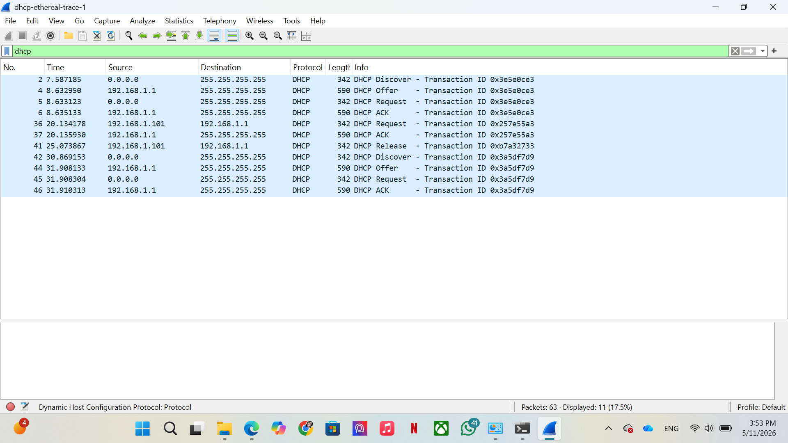

# Modul 11 - DHCP
#### Firda Utami Sukman - 103072400147 - IF-04-05

## 1. Apa itu DHCP?
DHCP (Dynamic Host Configuration Protocol) merupakan protokol jaringan yang secara otomatis memberikan konfigurasi jaringan kepada perangkat (host) yg terhubung ke suatu jaringan (alamat IP, subnet mask, default getaway, DNS server)

DHCP menggunakan model **client-server** di atas protokol **UDP**. Dengan adanya DHCP, administrator jaringan tidak perlu melakukan konfigurasi IP secara manual pada setiap perangkat.

## 2. Kelebihan dan Kekurangan DHCP
Kelebihan:
- **Otomatis**
  Alamat IP akan diberikan secara otomatis oleh sistem, sehingga pengguna atau administrator tidak perlu mengaturnya secara manual.

- **Cepat** 
  Proses pemberian alamat IP berlangsung sangat cepat, hanya dalam beberapa detik, melalui tahapan DORA (Discover, Offer, Request, dan Acknowledge).

- **Gratis** 
  DHCP adalah protokol yang dapat digunakan secara gratis dan sudah tersedia di hampir semua sistem operasi, sehingga tidak memerlukan biaya lisensi tambahan.

- **Menghindari bentrok IP**
  DHCP memastikan setiap perangkat mendapatkan alamat IP yang berbeda, sehingga tidak terjadi konflik IP antar perangkat di jaringan.

- **Menghindari konfigurasi invalid**
  Karena pengaturan IP dilakukan langsung oleh server, kemungkinan terjadinya kesalahan konfigurasi oleh pengguna menjadi lebih kecil.

Kekurangan:
- **Sulit di-tracking**
  Karena alamat IP dapat berubah-ubah secara otomatis, administrator menjadi lebih sulit mengetahui perangkat mana yang menggunakan IP tertentu. Hal ini dapat menyulitkan proses troubleshooting dan audit jaringan.

- **Butuh konfigurasi extra**
  Untuk perangkat yang membutuhkan alamat IP tetap, seperti server atau printer, diperlukan pengaturan tambahan seperti DHCP reservation agar alamat IP-nya tidak berubah.

## 3. DORA (Discover - Offer - Request - Acknowledge)
**DORA** merupakan proses empat tahap yang dilalui DHCP client untuk mendapatkan konfigurasi IP dari DHCP server.

Untuk mengumpulkan jejak paket DHCP, digunakan file *dhcp-wireshark-trace1-1.pcapng* yang tersedia pada modul praktikum. File tersebut dibuka menggunakan aplikasi Wireshark, kemudian lakukan filtering dengan mengetikkan "dhcp". Filter ini digunakan untuk menampilkan hanya paket yang menggunakan protokol DHCP dari seluruh lalu lintas jaringan yang tertangkap.

- **Discover**
Client yang belum memiliki alamat IP akan mengirim pesan DHCP Discover ke seluruh jaringan (broadcast) menggunakan alamat tujuan *255.255.255.255* dan source *IP 0.0.0.0.* Tujuannya adalah untuk mencari DHCP server yang tersedia di jaringan. Hal ini terlihat pada paket *No. 2 (t = 7.587185)* dengan *source 0.0.0.0* dan *destination 255.255.255.255*.

- **Offer**
Setelah menerima pesan Discover, DHCP server akan membalas dengan pesan DHCP Offer yang berisi penawaran konfigurasi jaringan, seperti alamat IP, subnet mask, gateway, dan lama waktu penggunaan IP (lease time).  Hal ini terlihat pada paket *No. 4 (t = 8.632950)*, ketika server dengan alamat *IP 192.168.1.1* mengirimkan pesan Offer ke alamat broadcast *255.255.255.255*.

- **Request**
Setelah menerima penawaran IP, client mengirimkan pesan DHCP Request untuk meminta secara resmi alamat IP yang dipilih. Pesan ini dikirim secara broadcast agar DHCP server lain yang sebelumnya juga memberikan Offer mengetahui bahwa penawarannya tidak dipilih. Hal ini terlihat pada paket *No. 5 (t = 8.633123)*, ketika client dengan source *IP 0.0.0.0* mengirimkan Request ke *255.255.255.255*.

- **Acknowledge (ACK)**
Setelah menerima DHCP Request, server mengirimkan pesan DHCP ACK sebagai konfirmasi bahwa alamat IP telah resmi diberikan kepada client. Setelah pesan ini diterima, client dapat menggunakan alamat IP tersebut selama masa lease time yang telah ditentukan. Hal ini terlihat pada paket *No. 6 (t = 8.635133)*, ketika server dengan alamat *IP 192.168.1.1* mengirimkan pesan ACK sebagai konfirmasi akhir.
