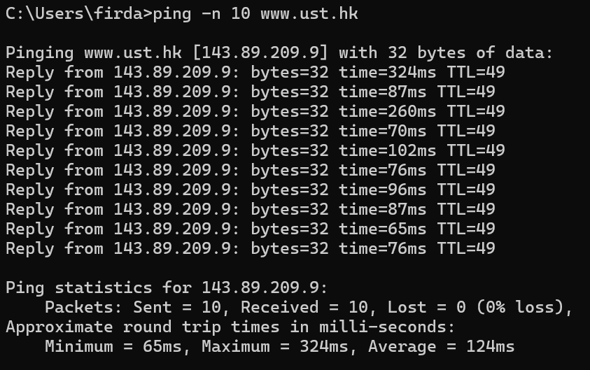
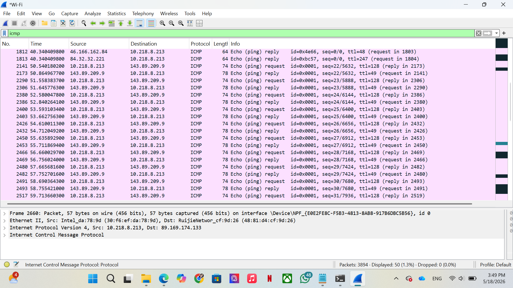
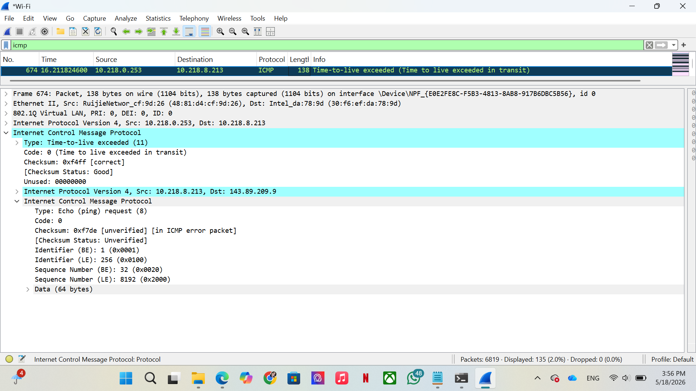

# Modul 12 - ICMP
#### Firda Utami Sukman - 103072400147 - IF-04-05

## 1. Pesan ICMP yang Dihasilkan oleh Program PING
Program PING digunakan untuk menguji apakah suatu host atau server dapat dijangkau melalui jaringan. PING bekerja menggunakan protokol **ICMP (Internet Control Message Protocol)** dengan mengirimkan pesan **Echo Request** dan menerima balasan berupa **Echo Reply**.

Langkah - Langkah:
- Buka Command Prompt
- Jalankan perintah: **ping -n 10 www.ust.hk**

- Amati proses ping seperti:
    - Reply from
    - TTL
    - Packet loss
    - Average time

### Analisis
Ketika perintah PING dijalankan, komputer pengirim akan mengirimkan ICMP Echo Request ke host tujuan. Jika host tujuan aktif dan dapat dijangkau, maka host tersebut akan membalas menggunakan Echo Reply. 
Waktu respon yang diperoleh berbeda-beda karena dipengaruhi kondisi jaringan dan banyaknya hop yang dilewati paket. Dari hasil pengamatan, koneksi jaringan berjalan dengan baik karena semua paket berhasil dikirim dan diterima.

## 2. Pesan ICMP yang Dihasilkan oleh Program Traceroute
Traceroute digunakan untuk mengetahui jalur atau hop yang dilewati paket menuju host tujuan. Traceroute memanfaatkan nilai **TTL (Time To Live)** pada paket IP.

Langkah - langkah:
- Buka aplikasi Wireshark
- Pilih interface jaringan yang sedang digunakan, misalnya Wi-Fi
- Klik Start Capturing Packets untuk mulai menangkap paket
- Lakukan ping pada Command Prompt seperti yang dilakuka tadi
- Tunggu hingga proses ping selesai
- Stop Capturing Paket pada Wireshark
- Gunakan filter **icmp**

- Klik salah satu paket dan buka bagian Internet Control Message Protocol

### Analisis
Ditemukan paket ICMP berikut: 
- *Type: Time-to-live exceeded (11)*
- *Code: 0 (Time to live exceeded in transit)*
- *Checksum: 0xf4ff [correct]*

Di dalam paket tersebut juga terdapat salinan paket asli:
- *Type: Echo (ping) request (8)*
- *Identifier: 1*
- *Sequence Number: 32*

Traceroute bekerja dengan mengirim paket yang memiliki nilai TTL tertentu. Setiap kali paket melewati router, nilai TTL akan berkurang satu. Ketika TTL mencapai nol, router akan membuang paket tersebut dan mengirim pesan ICMP Time Exceeded kepada pengirim.
Melalui pesan tersebut, pengirim dapat mengetahui alamat router yang dilewati paket. Dengan cara ini, traceroute dapat menampilkan jalur perjalanan paket dari sumber ke tujuan.

## 3. Format dan isi pesan ICMP
Pesan ICMP memiliki beberapa field penting seperti Type, Code, Checksum, Identifier, dan Sequence Number. Setiap field memiliki fungsi tertentu untuk membantu proses komunikasi, pengecekan koneksi, dan diagnosis jaringan.

Pada saat mengklik bagian *Internet Control Message Protocol*, akan muncul field yang terdapat pada paket yaitu:
- Type: 8
- Code: 0
- Identifier: 0x0001
- Sequence: 32
- Type: 11
- Code: 0
- Checksum: 0xf4ff

### Analisis 
Field Type menunjukkan jenis pesan ICMP yang digunakan, misalnya **Type 8** untuk Echo Request dan **Type 11** untuk Time Exceeded. Field Code memberikan informasi tambahan mengenai pesan tersebut.
Field Checksum digunakan untuk memastikan paket tidak rusak selama transmisi. Sedangkan Identifier dan Sequence Number digunakan untuk membedakan sesi komunikasi dan urutan paket.
Pada ICMP Type 11, field Identifier dan Sequence Number tidak terdapat langsung pada header utama, tetapi berada di dalam payload berupa salinan paket asli.